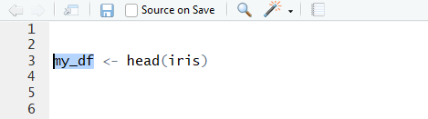
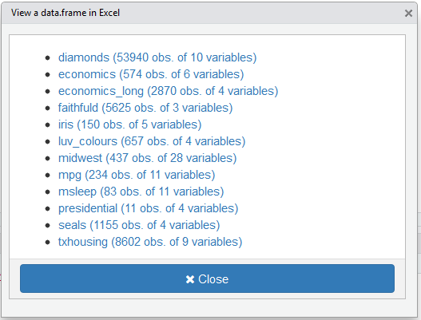
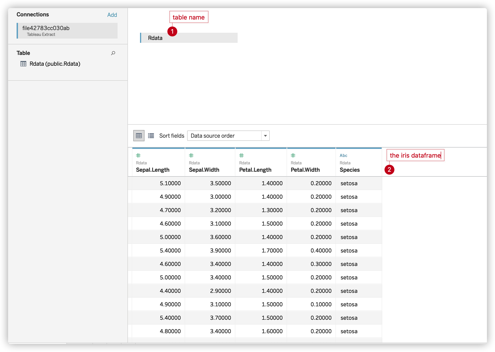

# viewTableau

> An addin to view data.frame in Tableau


[](https://travis-ci.org/jixing475/viewTableau)
[](http://www.repostatus.org/#active)


An addin to interactively export data.frame from global environment into Tableau with [`pantabR::frame_to_hyper`].

To try it, run : 

```r
# first install pantabR
devtools::install_github("btibert3/pantabR")

# then install viewTableau
devtools::install_github("jixing475/viewTableau")
```

Then launch the addin via the RStudio menu.

If you have selected a `data.frame` in your script, then this `data.frame`is open in Tableau. Otherwise a window will appear :


* select a `data.frame` then launch the addin, The selected `data.frame` will be open in Tableau directly :




* If no selection is made, a Shiny gadget is launched to select `data.frame` to open :





